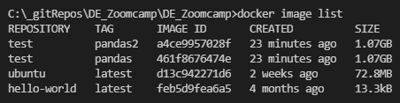
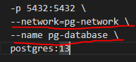
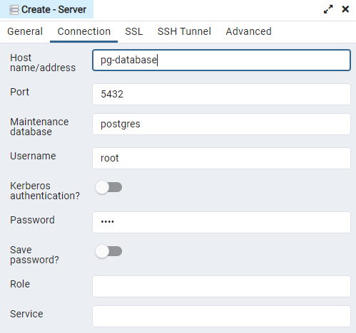
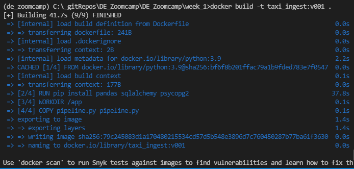

# Data Engineering Zoomcamp

This repository contains the notes and source code for the Data Engineering Zoomcamp that is hosted by [DataTalks.club](https://datatalks.club/).

## Week 1

Goal for week 1 is to setup a GCP environment, learn basics of Docker, run PostgreSQL in a docker container and execute some queries on the database running in the container

## Prerequisites
You need to setup your own Python anaconda environment and activate it. Alternatively, you can just install Python on your machine, directly, if you don't have it already.

Then, you must install pip, if you don't have it already and run `pip install -r requirements.txt`, that will go over the [requirements.txt](../requirements.txt) file and install all dependencies.

## 1. <u>Docker</u>

Essential steps for building and running a container
- Dockerfile - contains the description of the container and libraries installed inside the container
- `docker build -t test:pandas ./`  - is required to build the image for the container
    - `-t` option stands for: *Name and optionally a tag in the 'name:tag' format*
    - `./` option means that Docker will build an image in this directory
    - -it option would allow running the container with an interactive prompt (ex: `docker run -it test:pandas`) - allows you to see messages, prints, logs, bash command line etc, depending on the specification of `ENTRYPOINT`
    - the `test` parameter specifies the REPOSITORY for the container image and the `pandas` parameter specifies the TAG for a container image (check: `docker image list` in cmd) -> you can create multiple images in the same repository, with different tags

        

- `docker run -it test:pandas 2022-01-12` - is an example of a docker command that can be executed to run the container and also pass it a set of arguments for execution

- `docker container prune` - from time to time, it might be a good idea to run this command to remove all stopped containers, since every execution of `docker run` will cause a NEW container to be initialized

## 2. <u>Ingesting data into PostgreSQL in Docker container</u>

- docker compose is a way to run multiple Docker images
- running a container with PostgreSQL is as simple as running the command in [dckr_postgresql_server_run.bat](./dckr_postgresql_server_run.bat)
- connecting to the PostgreSQL database can be done through a cmd line **pgcli** and through a similar command: 

        pgcli -h localhost -p 5432 -u root -d ny_taxi

- we will ingest data for NYC Yellow Taxi rides from [NYC.gov](https://www1.nyc.gov/site/tlc/about/tlc-trip-record-data.page) website and download [this .CSV file](https://s3.amazonaws.com/nyc-tlc/trip+data/yellow_tripdata_2021-01.csv)
- the dataset has a [Data Dictionary](https://www1.nyc.gov/assets/tlc/downloads/pdf/data_dictionary_trip_records_yellow.pdf), explaining what each column means and what type of data is stored
- taxi rides in the main dataset refer to a pick-up and drop-off location, which is replaced with an ID. The main table with lookup values for pick-up and drop-off can be [downloaded from here](https://s3.amazonaws.com/nyc-tlc/misc/taxi+_zone_lookup.csv)
- for a detailed process of ingesting the data into the PostgreSQL database, have a look at the [test_notebook.ipynb](test_notebook.ipynb) file

---
## PRO TIP (not course related):
If like me, you accidentally commited a very large file (>100mb) in a previous commit and you can't push your changes to Github, you're now stuck. But, there's a solution. You can remove the file from the previous commit using this command:

        git filter-branch --index-filter "git rm -rf --cached --ignore-unmatch path_to_file" HEAD

You're welcome.

---

## 3. <u>Connecting pgAdmin to Postgresql</u>

- in order to run pgAdmin in a Docker container, we can use a command similar to the one in [dckr_pgAdmin_run.bat](dckr_pgAdmin_run.bat)
- because our database's server runs on "localhost" which is relative to the container it runs in, we need to expose the database server in order to connect to it, from pgAdmin. In order to do that, we will have to create a network in Docker and connect the two.
- In order to create the network we will have to run `docker network create <network-name>` 
    
        Ex: docker network create pg-network

- then we have to expand the docker run commands and add the network in their definition and also a named-identifier for each service/container

    
- after starting both containers, all we have to do is go to localhost:8080 to access pgAdmin, create a server with the following config and connect to it

    

## 4. <u>Dockerizing the Ingestion script</u>

- we can use the code in the already written Jupyter Notebook to generate the script that inputs data to PostgreSQL. In order to convert the notebook to a Python script, we can open a cmd line and run 
        
        jupyter nbconvert --to=script test_notebook.ipynb

- we will need to manually cleanup the file, but it contains all the Python code, which can be found in [data_ingestion.py](data_ingestion.py)
- after creating the pipeline code in the Python file, we will have to run the file using a command like:
    
        python data_ingestion.py \
            --user=root \
            --password=root \
            --host=localhost \
            --port=5432 \
            --database=ny_taxi \
            --table=yellow_taxi_trips \
            --csv_url="https://s3.amazonaws.com/nyc-tlc/trip+data/yellow_tripdata_2021-01.csv"

- now that we have tested our pipeline data ingestion script, we will need to dockerize it. We will have to first update the Dockerfile and we will <u>**make sure to change the pipeline file which processes the data**</u>. Then add commands to install the necessary Python libraries for connecting to Postgresql. The Dockerfile will look something like:

        FROM python:3.9

        RUN pip install pandas sqlalchemy psycopg2

        WORKDIR /app
        COPY data_ingestion.py data_ingestion.py

        ENTRYPOINT ["python", "data_ingestion.py"]

- with the new definition of the Dockerfile, we now have to build the image for this new container by using the following command

        docker build -t taxi_ingest:v001 .

- the output should look something like below 

    

- to run the docker file, we can just run the container and pass it the parameters, just like you would pass the parameters to the Python file. **Make sure you specify the network parameter when running the container so that it will have access to PostgreSQL**

        docker run -it ^
                --network=pg-network ^
                taxi_ingest:v001 ^
                --user=root ^
                --password=root ^
                --host=pg-database ^
                --port=5432 ^
                --database=ny_taxi ^
                --table=yellow_taxi_trips ^
                --csv_url="https://s3.amazonaws.com/nyc-tlc/trip+data/yellow_tripdata_2021-01.csv"

## 5. <u>Running Postgresql and pgAdmin with Docker-Compose</u>
- you can create all the docker containers in a single definition by using docker-compose, instead of having different definitions of containers ran in different terminal windows
- another benefit of running everything in a single docker-compose file is that the network is automatically created so that containers defined in the same docker-compose file can talk to eachother and can be referenced by their name
- so, redefining the entire container structure can be found in [docker-compose.yaml](docker-compose.yaml)
- in order to run the container configuration from docker-compose you need to run
        
        docker-compose up

- if you want to start the containers but also continue to have access to the terminal, you can run in **detach mode**

        docker-compose up -d

- in order to shutdown everything, you need to run

        docker-compose down

## 6. <u>Intro to Terraform & GCP Pre-requisites</u>
- everything is very well explained in this video (click it)

  

  https://www.youtube.com/watch?v=Hajwnmj0xfQ

<iframe width="560" height="315" src="https://www.youtube.com/embed/Hajwnmj0xfQ" title="YouTube video player" frameborder="0" allow="accelerometer; autoplay; clipboard-write; encrypted-media; gyroscope; picture-in-picture" allowfullscreen></iframe>

here