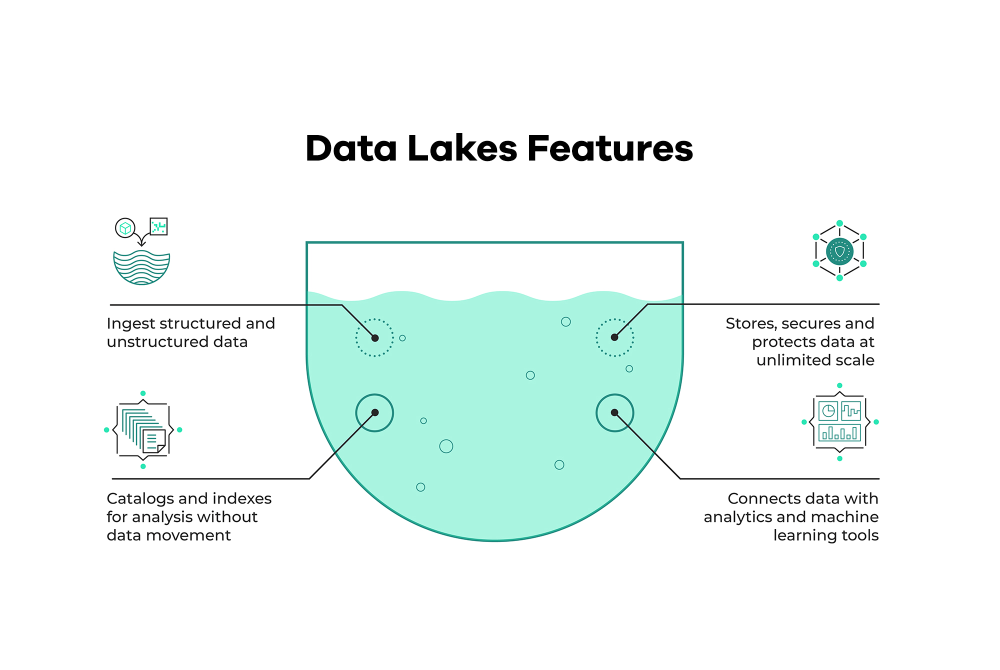
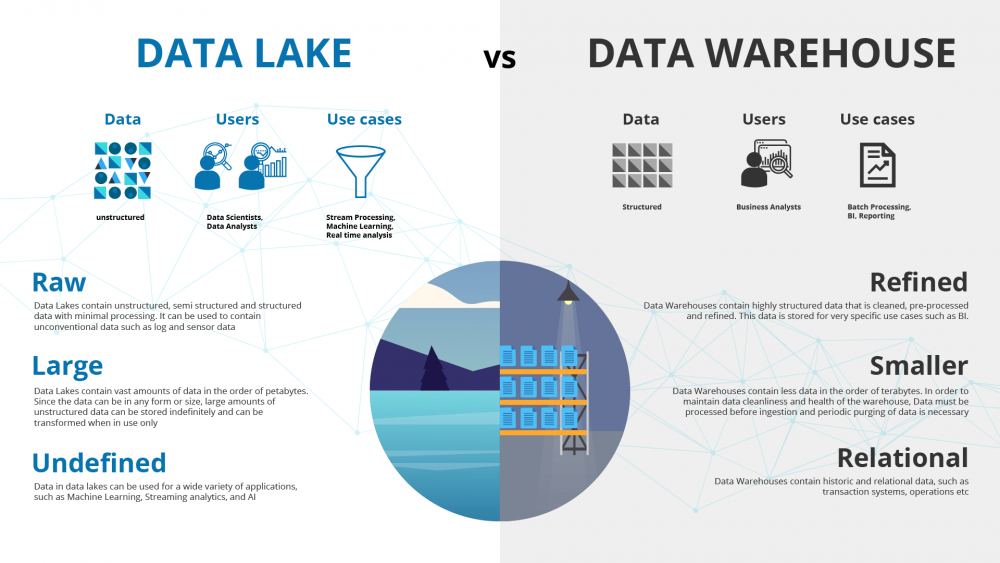
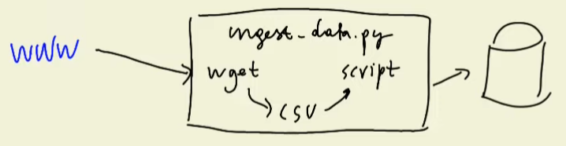
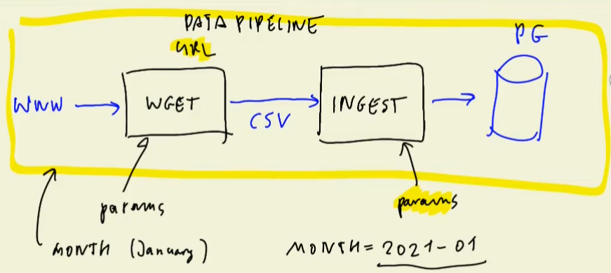
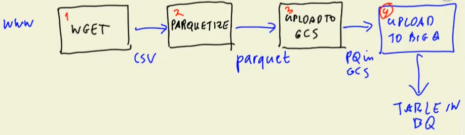

# Data Engineering Zoomcamp

This repository contains the notes and source code for the Data Engineering Zoomcamp that is hosted by [DataTalks.club](https://datatalks.club/).

## Week 2

Goal for [week 2](https://github.com/DataTalksClub/data-engineering-zoomcamp/tree/main/week_2_data_ingestion) is to cover the topics of Data Lake, getting an introduction to Workflow orchestration with Airflow, setting it up locally and then ingesting data to GCP and locally to PostgreSQL using Airflow DAGs. Finally, we'll also go over how to move files from AWS to GCP using Transfer Service.

## 1. [<u>Data Lake</u>](https://www.youtube.com/watch?v=W3Zm6rjOq70)

A Data Lake is a central repository which stores big data coming from many sources. Generally, data can be structured, unstructured or semi-structured.

The main idea is to **ingest data and make it available as fast as possible** to other services or engineers or data scientists.

A Data Lake solution has to be secure and run at scale. The hardware also needs to be **inexpensive**.

The use cases for a data lake are usually stream analytics, machine learning and real-time analytics.

The use cases for a data warehouse are generally batch reporting and BI reporting and is generally used by BI developers.

### How did the Data Lake start?

- Companies realized the value of data
- Store and access data quickly
- Cannot always define structure of data
- Usefulness of data being realized later in the project lifecycle
- Increase in data scientists
- R&D on data products
- Need for Cheap storage of Big data

### ETL vs ELT

- ETL stands for Extract, Transform and Load
- ELT stands for Extract, Load and Transform

- ETL is used for relatively small amounts of data
- ELT is used for very large amounts of data

- ETL is a data warehouse solution, based on the **schema on write** principle
- ELT is a data lake solution, based on the **schema on read** principle

### Gotchas for Data Lakes
- Many times a Data Lake turns into a Data Swamp
- Some of the reasons is because there is no versioning of the data
- There are incompatible schemas for the same data, without versioning
- No metadata associated
- There is no way to join data together

---

## 2. [<u>Workflow orchestration</u>](https://www.youtube.com/watch?v=0yK7LXwYeD0)

- Taken example what we have done in the previous week, where we had the [ingest_data.py](../week_1/data_ingestion.py)
- We had our pipeline script in a single Python file, deployed in a container where this pipeline file executed more steps (accesses the web, downloads .csv file, processes it with a script)

    

- If there is ever an issue with the script (ex: internet is cut off), our entire pipeline script fails
- Ideally, we want to split all of these steps into their own scripts, so that we have more control over them and can re-execute them, if necessary
- It would be better if we reorganized our pipeline and parametrized each script, like in the below diagram

    

- We can improve this architecture by instead saving the data as a .csv file, we sill save it as Parquet format, which is more efficient way of storing data on disk

    

- There are different tools for workflow orchestration
    - Luigi
    - Apache Airflow (we will use it in the course)
    - Prefect

## 3. [<u>Setup Airflow Environment with Docker-Compose</u>](https://www.youtube.com/watch?v=lqDMzReAtrw)